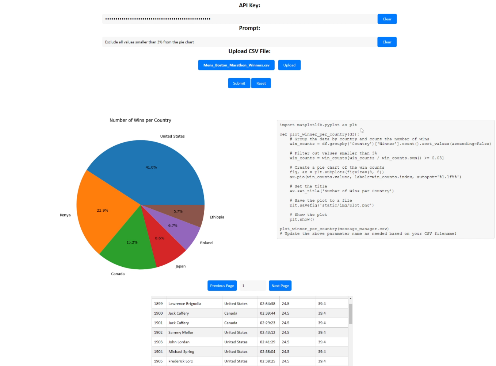

# ChatToViz
This project provide a user interface via web app to interact with ChatGPT model to create data visualization. The user can upload a dataset in tabular format and ask the ChatGPT model in human language to create specific visualization. If user is not satisfy with the result, user can follow up with feedbacks for the model to modify the visualization.



<br>

# Authors:
- **JiangLong He**
- **Nicholas Broome**
- **Omar Hammami**

<br>

# Install Dependencies
```bash
pip3 install -r requirements.txt
```

<br>

# How to use:
2. Use `flask run` in your terminal/Virtual Python Environment to setup the flask server. 
3. Open the browser to the address displayed in the terminal (usually port 5000 by default).
4. Input OpenAI API key for your model.
5. Upload CSV file of your choice, or use one that was supplied in the folder. NOTE: A CSV with NaN values may cause errors when running.
6. Enter a prompt to generate a visualization with the CSV data.
7. Wait briefly, then your visualization and code should appear.
8. Follow up with new prompt to modify the visualization if necessary.

<br>

# Video Demo
 https://www.youtube.com/watch?v=IJeWpn6tbF4&list=LL
